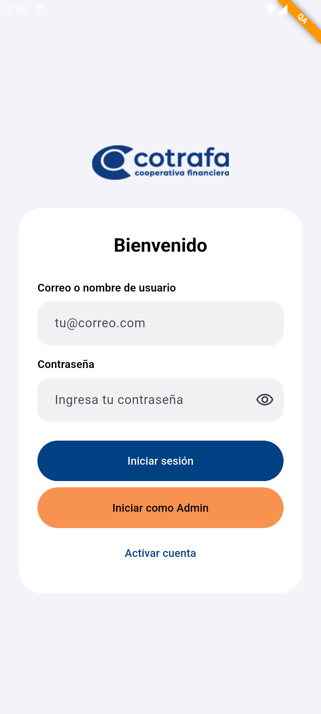
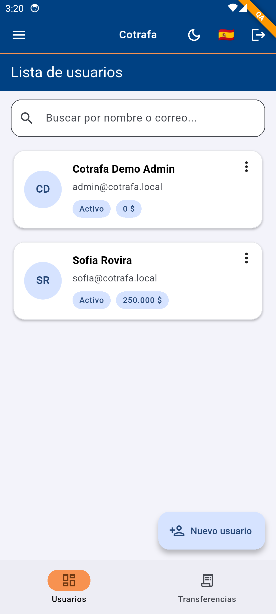
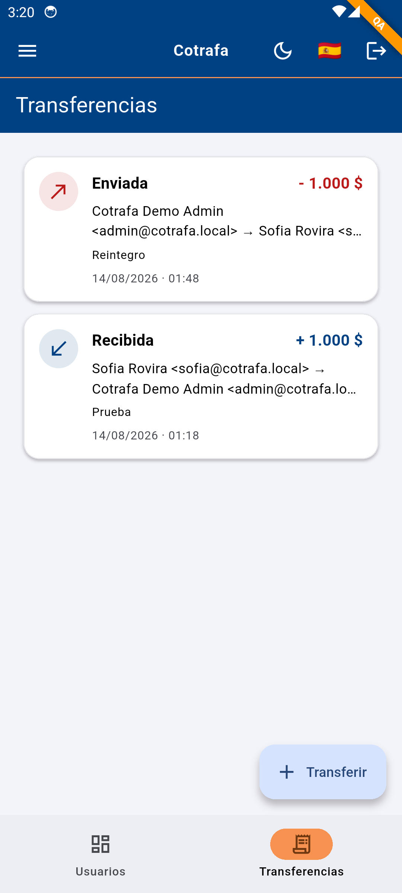
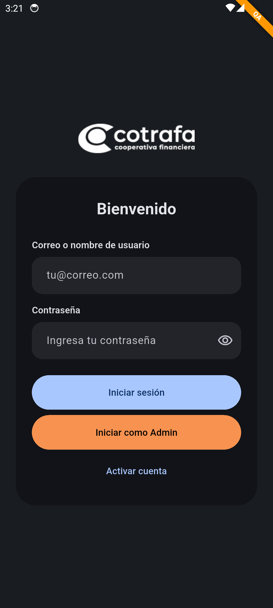
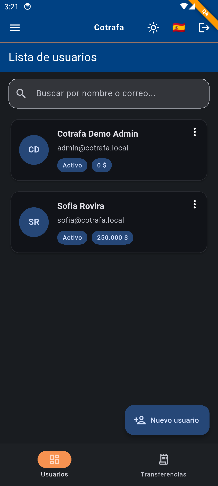
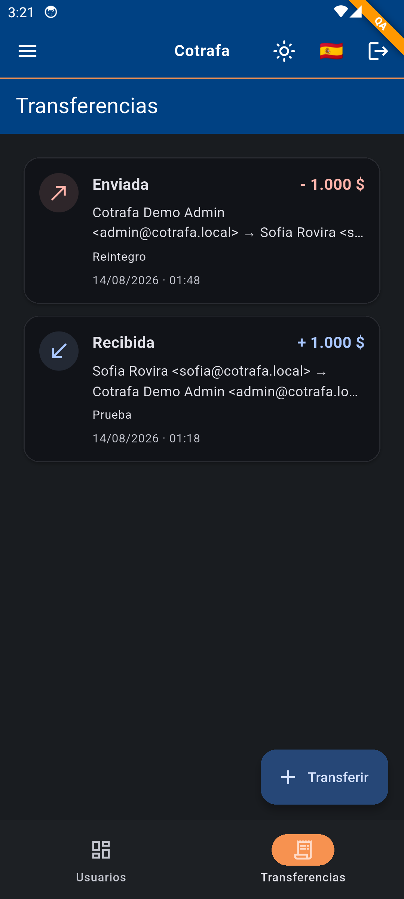

# Prueba Tecnica Cotrafa

Prueba técnica de banca local construida con Flutter 3.47.1, BLoC, Drift y Clean Architecture. La aplicación cubre autenticación, gestión de usuarios, direcciones y transferencias con persistencia transaccional.

Arquitectura de **monorepo con Melos**, Clean Architecture por feature y soporte para Mobile, Web y Desktop.

[](https://github.com/andresroviram/cotrafa/actions/workflows/ci.yml) [](https://codecov.io/gh/andresroviram/cotrafa)

## Screenshots

### Mobile — Light Theme

<br>
<p align="center">



</p>

### Mobile — Dark Theme

<br>
<p align="center">



</p>

## Stack tecnológico

- Flutter 3.47.1 y Dart 3.13.1 mediante FVM
- Clean Architecture por feature
- Melos para administración del monorepo
- BLoC (`flutter_bloc`) con eventos y estados Freezed
- `go_router` con `StatefulShellRoute.indexedStack`
- GetIt e Injectable para inyección de dependencias
- Drift y SQLite para persistencia local transaccional en Mobile, Desktop y Web
- Envied y `--dart-define=FLAVOR` para configuración dev/qa/prod
- Adaptive Theme, Responsive Framework y Material 3
- Bot Toast mediante `AppNotification`
- Easy Localization
- Dio, interceptores y manejo centralizado de errores en Core
- `cryptography` para credenciales y códigos de activación
- Pruebas unitarias, de widgets, arquitectura y cobertura LCOV
- Prueba de integración del recorrido crítico sobre un emulador Android real

## Clean Architecture

Cada feature conserva tres capas y depende hacia el dominio:

- **Presentation**: UI responsive, BLoC, eventos y estados.
- **Domain**: entidades, contratos de repositorio y casos de uso.
- **Data**: implementaciones de repositorio y datasources Drift.

La base de datos vive en un package independiente. Los features declaran puertos de datasource y reciben sus implementaciones mediante DI, evitando ciclos entre la app, la persistencia y los módulos funcionales.

<br>
<p align="center">

</p>

## Estructura del monorepo

```text
cotrafa/
├── apps/
│   └── cotrafa-app/
│       ├── lib/
│       │   ├── main.dart
│       │   ├── app.dart
│       │   └── config/
│       │       ├── env/         # Flavors y Envied
│       │       ├── injectable/  # Composition root con GetIt
│       │       ├── routes/      # go_router
│       │       └── theme/       # Temas claro y oscuro
│       ├── integration_test/    # Recorrido crítico móvil
│       ├── screenshots/mobile/
│       └── web/                 # SQLite WASM y Drift worker
├── packages/
│   ├── core/                    # Result, errores, seguridad, red y utilidades
│   ├── components/              # Layouts, navegación y widgets compartidos
│   ├── database/                # Tablas y CotrafaDatabase
│   └── features/
│       ├── auth/                # Sesión, activación y roles
│       ├── user/                # Usuarios y direcciones
│       └── transfer/            # Transferencias e historial
├── scripts/                     # Setup web y cobertura
├── .github/workflows/ci.yml     # CI y artefactos Android/Web
└── codemagic.yaml               # CI/CD por flavor
```

## Cómo ejecutar

### Requisitos

- FVM
- Flutter 3.47.1
- Android Studio/JDK 17 para Android
- Xcode y CocoaPods para iOS/macOS

```bash
# 1. Clonar el repositorio
git clone https://github.com/andresroviram/cotrafa.git
cd cotrafa

# 2. Instalar FVM y la versión fijada de Flutter
dart pub global activate fvm
fvm install 3.47.1
fvm use 3.47.1

# 3. Bootstrap del workspace
melos bootstrap

# 4. Crear los archivos de entorno
cp apps/cotrafa-app/.env.example apps/cotrafa-app/.env.dev
cp apps/cotrafa-app/.env.example apps/cotrafa-app/.env.qa
cp apps/cotrafa-app/.env.example apps/cotrafa-app/.env.prod

# 5. Generar Freezed, Drift, Injectable, Envied y el worker web
fvm dart run melos run build:cotrafa-all

# 6. Ejecutar en un dispositivo móvil
fvm dart run melos run run:mobile
```

`run:mobile` selecciona por defecto el emulador Android y excluye Desktop y
Web. Para usar otro dispositivo móvil conectado, indica su ID:

```bash
MOBILE_DEVICE_ID=<device-id> fvm dart run melos run run:mobile
```

También puedes seleccionar un flavor directamente:

```bash
cd apps/cotrafa-app
fvm flutter run --dart-define=FLAVOR=dev
fvm flutter run --dart-define=FLAVOR=qa
fvm flutter run --dart-define=FLAVOR=prod
```

### Acceso inicial

- **Administrador demo**: pulsa `Iniciar como Admin`; la credencial fija se inyecta y no se escribe en la pantalla.
- **Cliente**: el administrador crea la cuenta y entrega un código temporal.
- **Primer acceso**: el cliente registra un nombre de usuario único y su contraseña.
- **Accesos posteriores**: puede iniciar sesión con correo o nombre de usuario.

## Configuración web — Drift + SQLite

El repositorio incluye `sqlite3.wasm`. Para descargar nuevamente la versión fijada y recompilar el worker:

```bash
# Linux/macOS
chmod +x scripts/setup_web.sh
./scripts/setup_web.sh

# Windows PowerShell
.\scripts\setup_web.ps1
```

Luego ejecuta:

```bash
fvm dart run melos run run:web
```

## Scripts de Melos

| Comando | Descripción |
| --- | --- |
| `melos bootstrap` | Instala y enlaza todas las dependencias del workspace. |
| `fvm dart run melos run build:cotrafa-all` | Genera Core → Database → Auth → User → Transfer → App → worker web. |
| `fvm dart run melos run generate` | Ejecuta build_runner en los packages que lo requieren. |
| `fvm dart run melos run build:watch` | Mantiene build_runner en modo watch. |
| `fvm dart run melos run format:check` | Verifica formato sin modificar archivos. |
| `fvm dart run melos run format:fix` | Aplica formato a fuentes Dart no generadas. |
| `fvm dart run melos run analyze` | Ejecuta análisis estático en todo el workspace. |
| `fvm dart run melos run analyze:changed` | Analiza packages modificados frente a `origin/main`. |
| `fvm dart run melos run test` | Ejecuta todas las pruebas. |
| `fvm dart run melos run test:integration` | Ejecuta el recorrido crítico en un Android conectado. |
| `fvm dart run melos run test:coverage` | Genera `coverage/lcov.info` por package. |
| `fvm dart run melos run test:changed` | Prueba packages modificados frente a `origin/main`. |
| `fvm dart run melos run coverage:check` | Exige al menos 60 % de cobertura de líneas. |
| `fvm dart run melos run clean:generated` | Elimina fuentes generadas. |
| `fvm dart run melos run setup:web` | Instala SQLite WASM y compila el worker Drift. |
| `fvm dart run melos run ci` | Ejecuta formato, análisis y pruebas. |
| `fvm dart run melos run run:mobile` | Ejecuta Cotrafa en el emulador Android o en `MOBILE_DEVICE_ID`. |
| `fvm dart run melos run run:web` | Ejecuta Cotrafa en Chrome, puerto 4002. |
| `fvm dart run melos run run:desktop` | Ejecuta Cotrafa en macOS. |

## Flavors

| Flavor | Rama | Banner | Uso |
| --- | --- | --- | --- |
| `dev` | `develop` | Verde | Desarrollo local e integración interna. |
| `qa` | `main` | Naranja | Validación de calidad. |
| `prod` | `release/*` o `v*` | Sin banner | Publicación. |

Cada entorno tiene su archivo local, excluido de Git:

| Archivo | Clase Envied |
| --- | --- |
| `apps/cotrafa-app/.env.dev` | `EnvDev` |
| `apps/cotrafa-app/.env.qa` | `EnvQa` |
| `apps/cotrafa-app/.env.prod` | `EnvProd` |

`build_runner` genera los tres entornos. `--dart-define=FLAVOR` selecciona uno en runtime sin regenerar.

## CI/CD y despliegue

### GitHub Actions

`.github/workflows/ci.yml` ejecuta en cada push y pull request:

1. Flutter 3.47.1 con FVM y JDK 17.
2. Bootstrap y generación de código.
3. Formato y análisis estático.
4. Pruebas con umbral de cobertura del 60 %.
5. Recorrido crítico en un emulador Android: acceso de administrador, creación y activación de cliente, dirección y transferencia.
6. Artefactos QA para Android y Web.

El artefacto Web se compila para verificación; por ahora no se publica una demo en vivo.

### Codemagic

`codemagic.yaml` define la estrategia de ramas y flavors:

| Workflow | Rama | Resultado |
| --- | --- | --- |
| `ci` | Todas | Formato, análisis, pruebas y cobertura. |
| `android-dev` | `develop` | AAB → Google Play internal. |
| `android-qa` | `main` | AAB → Google Play alpha. |
| `android-prod` | `release/*`, `v*` | AAB → Google Play production. |
| `ios-dev` | `develop` | IPA → TestFlight interno. |
| `ios-qa` | `main` | IPA → TestFlight externo. |
| `ios-prod` | `release/*`, `v*` | IPA → App Store. |
| `web-dev` | `develop` | Artefacto Web DEV. |
| `web-prod` | `release/*` | Artefacto Web PROD, sin despliegue público. |

Configura estos grupos en **Codemagic → App Settings → Environment variables**:

| Grupo | Variables |
| --- | --- |
| `env_dev` | `DEV_BASE_URL`, `DEV_API_KEY` |
| `env_qa` | `QA_BASE_URL`, `QA_API_KEY` |
| `env_prod` | `PROD_BASE_URL`, `PROD_API_KEY` |
| `android_signing` | `ANDROID_KEYSTORE_BASE64`, `KEYSTORE_PASSWORD`, `KEY_ALIAS`, `KEY_PASSWORD` |
| `google_play` | `PLAY_STORE_SERVICE_ACCOUNT_JSON` |
| `ios_signing` | `APP_STORE_CONNECT_PRIVATE_KEY`, `APP_STORE_CONNECT_API_KEY_ID`, `APP_STORE_CONNECT_ISSUER_ID` |
| `codecov` | `CODECOV_TOKEN` |

> Antes de publicar en las tiendas, reemplaza los identificadores `com.example.*` por los identificadores definitivos y registra las aplicaciones en Google Play y App Store Connect.

## Cobertura de Tests

El proyecto mantiene un umbral mínimo de cobertura del **60%** en el CI/CD. Los archivos generados por Drift, Freezed e Injectable no se incluyen en la medición.

### Estado actual

```text
Total:                    80.34% ✅ (2677/3332 líneas)
├─ features/              83.00% ✅ (2451/2953 líneas)
├─ components/            85.71% ✅ (24/28 líneas)
├─ apps/cotrafa-app/      78.36% ✅ (105/134 líneas)
├─ core/                  45.45% ⚠️ (40/88 líneas)
└─ database/              44.19% ⚠️ (57/129 líneas)
```

El umbral se aplica al **total consolidado del workspace**. Core y Database quedan identificados como las áreas prioritarias para elevar la cobertura por package.

### Resumen de tests

- **189 tests** ejecutándose exitosamente.
- **1 prueba de integración móvil** para el recorrido crítico completo en Android.
- **50 tests de widgets** para vistas, formularios, navegación y componentes.
- **36 tests de BLoC** para eventos, estados y transiciones.
- **103 tests adicionales** de dominio, datasources, repositorios, persistencia, DI y arquitectura.
- **80.34% de cobertura total**, 20.34 puntos por encima del umbral del 60%.

### Scripts de cobertura

```powershell
# Windows
.\scripts\check_coverage.ps1
.\scripts\check_coverage.ps1 -Threshold 70
```

```bash
# Linux/macOS
./scripts/check_coverage.sh
./scripts/check_coverage.sh 70
```

### Generar y abrir el reporte HTML

El reporte consolidado que usa CI se genera desde la raíz del proyecto con:

```bash
# Ejecuta los tests, consolida coverage/lcov.info y valida el umbral del 60 %
./scripts/check_coverage.sh 60
```

Este script ejecuta internamente `fvm dart run melos run test:coverage` para crear
los reportes LCOV de cada package. Si `genhtml` está instalado, también genera
`coverage/html/index.html`.

```bash
# macOS (instalación y apertura)
brew install lcov
open coverage/html/index.html

# Linux (instalación y apertura)
sudo apt-get install lcov
xdg-open coverage/html/index.html
```

En Windows, el reporte HTML puede generarse con el script Bash desde WSL o Git
Bash y abrirse desde PowerShell:

```powershell
Start-Process .\coverage\html\index.html
```

Los scripts verifican automáticamente:

- ✅ Ejecutan todos los tests del monorepo.
- ✅ Generan reportes LCOV por package.
- ✅ Consolidan las rutas de fuentes sin colisiones entre packages.
- ✅ Excluyen código generado de la medición.
- ✅ Comparan el resultado con el umbral configurado.
- ✅ Fallan con un código de salida distinto de cero cuando no se cumple.

Además, el pipeline valida formato, análisis estático y builds reproducibles con Flutter 3.47.1, FVM, Melos y JDK 17.

## Features

### Autenticación

- Inicio de sesión con correo electrónico o nombre de usuario.
- Administrador demo con credencial fija inyectada.
- Activación de clientes mediante código temporal de un solo uso.
- Creación de nombre de usuario y contraseña durante el primer acceso.
- Regeneración de códigos por el administrador.
- Restauración y cierre seguro de sesión.
- Roles `admin` y `client` con autorización en datasource.

### Gestión de usuarios

- Crear, listar, buscar, editar, desactivar y eliminar usuarios cuando las reglas lo permiten.
- Nombre, apellido, fecha de nacimiento, teléfono y datos opcionales de perfil.
- Saldo inicial definido únicamente por el administrador.
- Consulta del saldo disponible.
- Gestión de direcciones con exactamente una principal cuando existen registros.
- Selección y promoción de dirección principal dentro de transacciones Drift.

### Transferencias

- Registro de usuario origen, usuario destino, valor y descripción opcional.
- Rechazo de saldo insuficiente y de operaciones inválidas.
- Creación, débito, crédito e historial en una única transacción local.
- Validación de exactamente una fila debitada y una acreditada.
- Resultado independiente para éxito o fallo.
- Historial persistido con snapshots inmutables de las partes.
